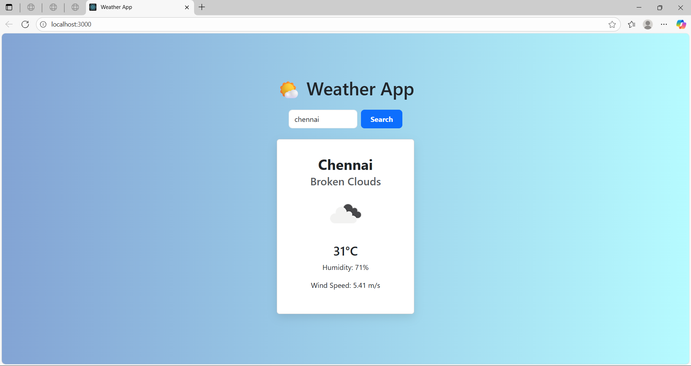

# 🌤️ Weather App

A simple and responsive weather forecast application built using **React.js**, **Axios**, and **Bootstrap**.  
It fetches real-time weather data from the [OpenWeatherMap API](https://openweathermap.org/api) and displays it in a user-friendly card layout.

---

## Features
- 🔍 Search weather by city name.
- 🌡️ Displays temperature, weather condition, humidity, and wind speed.
- 🕒 Real-time data fetching.
- 🎨 Clean and responsive design.

---

## 📸 Screenshots

### 🏠 Home page


---

## 🛠️ Tech Stack
- **React.js** (Frontend Framework)
- **Axios** (HTTP requests)
- **Bootstrap** (UI styling)
- **HTML5 & CSS3**
- **OpenWeatherMap API** (Weather data)

---

## 📦 Installation
**1. Clone the repository:**
- git clone https://github.com/jeevitha28-g/weather-app.git

**2. Navigate to the project directory:**
- Run in the Terminal or the Command Prompt
```bash  
cd weather-app
```

**3. Install required dependencies:**
- If you're using Python/Flask or Node.js backend, mention requirements.txt or package.json here. If it's pure HTML/JS, you can skip.
```bash
npm install
```

**4. Run the project:**
- Option 1: Once the dependencies are installed, start the development server
```bash
npm start
```

- Option 2: This command will start the app and open it in your default web browser. If it doesn't open automatically, you can manually visit
```bash
http://localhost:3000
```

**5.Troubleshooting:**
- If you encounter any issues with the app not starting, make sure
1. You have the required version of Node.js and npm installed.
2. You’ve run the npm install command to install dependencies.

**6. Building for Production:**
- If you want to build the app for production (e.g., deploy it), you can use the following command
```bash
npm run build
```

---

## Explanation
**1. Clone the repository**: This step clones your GitHub repository to the user's machine.

**2. Install Dependencies**: Ensures the user installs all the necessary dependencies to run the app.

**3. Run the Application**: Runs the development server and opens the app in the browser (typically on `http://localhost:3000`).

**4. Troubleshooting**: Provides simple troubleshooting steps in case the app doesn’t start.

**5. Build for Production**: Explains how to create a production build of the app if users want to deploy it.

---

## Folder Structure
```bash
weather-app/
│
├── public/
│   └── index.html
│
├── src/
│   ├── components/
│   │   ├── WeatherCard.jsx
│   │   └── SearchBar.jsx
│   ├── App.js
│   ├── App.css
│   └── index.js
│
├── package.json
└── README.md
```

---

## Usage
- Enter the city name in the search box.
- Click the Search button.
- View the current weather details fetched from the weather API.

---

## Technologies Used
- 🌐 HTML, CSS, JavaScript
- ☁️ Weather API (like OpenWeatherMap or WeatherAPI)

---

## License
This project is licensed under the MIT License - feel free to use and modify!

---

## Contact
Made with 💙 by [Jeevitha](https://github.com/jeevitha28-g)
